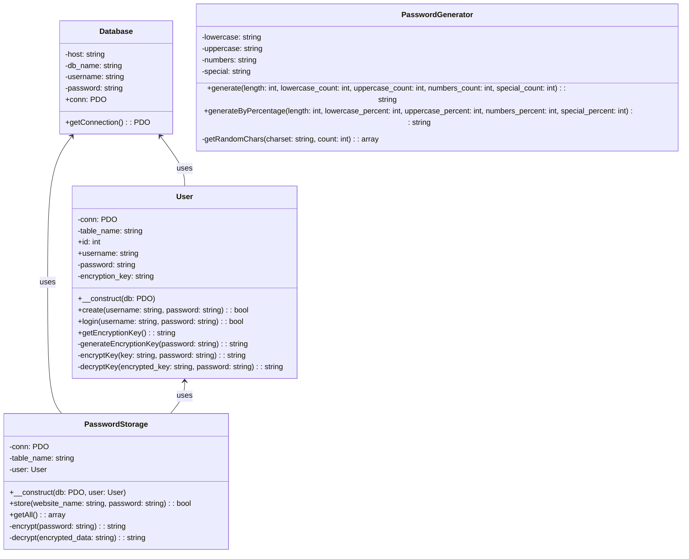

# UML Class Diagram

## Class Relationships

1. **Database Class**
   - Core database connection management
   - Used by both User and PasswordStorage classes

2. **User Class**
   - Handles user authentication and encryption key management
   - Depends on Database class for data persistence
   - Used by PasswordStorage for encryption operations

3. **PasswordGenerator Class**
   - Independent utility class for password generation
   - No dependencies on other classes

4. **PasswordStorage Class**
   - Manages password storage and retrieval
   - Depends on Database class for data persistence
   - Depends on User class for encryption key access 