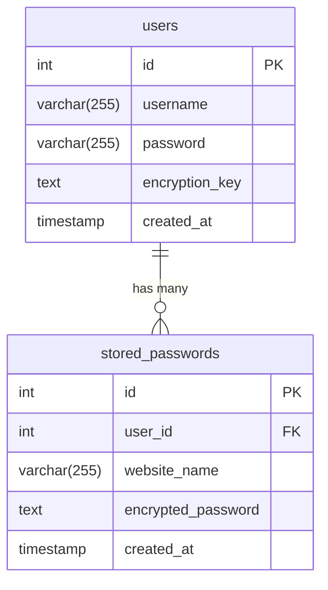

# Database Schema Diagram

## Table Relationships

1. **users table**
   - Primary table for user authentication
   - Stores user credentials and encryption keys
   - One user can have multiple stored passwords
   - Fields:
     - id: Auto-incrementing primary key
     - username: Unique user identifier
     - password: Bcrypt hashed password
     - encryption_key: AES encrypted key
     - created_at: Account creation timestamp

2. **stored_passwords table**
   - Stores encrypted passwords for various websites/applications
   - Each record belongs to a specific user
   - Fields:
     - id: Auto-incrementing primary key
     - user_id: Foreign key to users table
     - website_name: Name of the website or application
     - encrypted_password: AES encrypted password
     - created_at: Password storage timestamp 